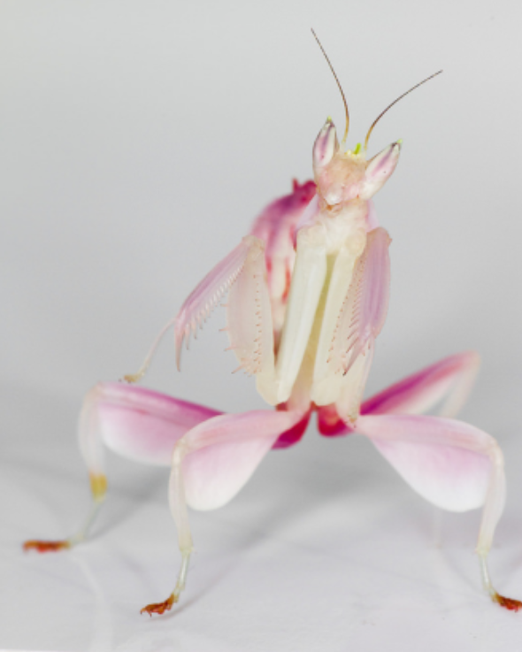

## The project is dedicated to Grad-CAM, which is a technique for understanding Deep CNN models.

The algorithm proposed by a paper: https://arxiv.org/abs/1610.02391

In the project implemented recognition of a picture of the mantis by three models:
- VGG16
- ResNet50
- EfficientNetV2L 
and applied Grad-CAM to understand the results.

VGG16 recognized cricket with the probability 28%, mantis - 0.7%. 
ResNet50 recognized lacewing with the probability 50%, mantis - 18%. 
EfficientNetV2L recognized mantis with the probability 83%.

The project was created in Google Colab.

